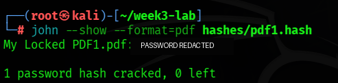
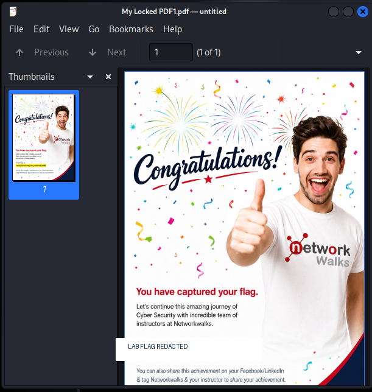
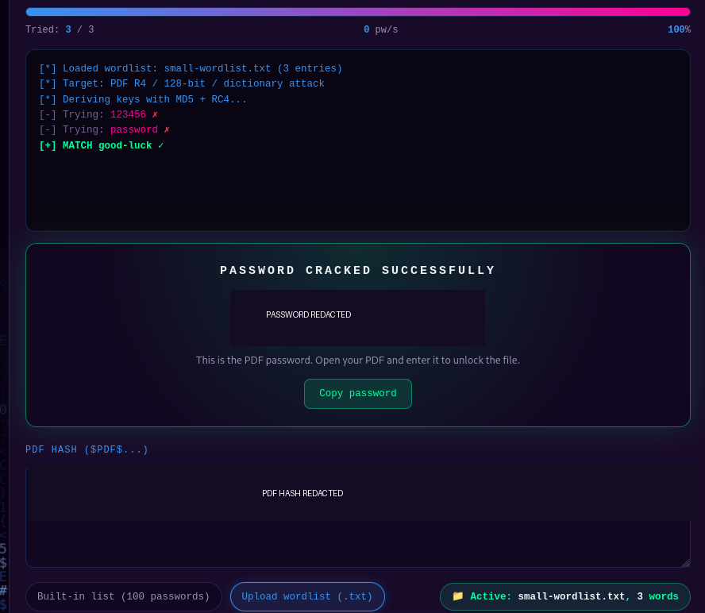

# Week 3 Cybersecurity & Ethical Hacking Project

**Student:** Shiv Das  
**Batch:** BO83  
**Program:** Networkwalks Internship  
**Date:** 25 September 2026  
**Platform:** Kali Linux  

## Project Overview

This repository documents Week 3 practical activities covering authorized PDF password auditing with John the Ripper and Networkwalks browser-based tools.

The work was completed against the instructor-provided sample file `My Locked PDF1.pdf` in a controlled learning environment. The objective was to understand how password hashes are extracted, how dictionary attacks work, how recovered passwords are verified, and why strong passwords are important.

> **Ethics statement:** Testing was restricted to the course-provided sample PDF. No real user accounts, third-party systems, or personal data were targeted. Password-auditing tools must only be used with explicit authorization.

## Modules Completed

- **PM1 — Password Cracking with John the Ripper**
- **PM2 — Password Cracking with Networkwalks Tools**

---

# PM1 — Password Cracking with John the Ripper

## Objective

Recover the password of the instructor-provided protected PDF using John the Ripper on Kali Linux and verify the result by opening the PDF.

## Tools Used

- Kali Linux
- John the Ripper: `/usr/sbin/john`
- PDF hash converter: `/usr/share/john/pdf2john.pl`
- Kali dictionary: `/usr/share/wordlists/rockyou.txt`
- PDF viewer for verification

## Step 1 — Prepare the lab folder

A dedicated lab directory was created for the PDF, hash file, wordlist, and evidence.

```bash
mkdir -p ~/week3-lab/{evidence,hashes}
cd ~/week3-lab
```

## Step 2 — Locate the PDF-to-hash converter

John the Ripper includes a PDF hash extraction utility.

```bash
find /usr/share/john -name "pdf2john*" 2>/dev/null
```

The converter was located at:

```text
/usr/share/john/pdf2john.pl
```

## Step 3 — Extract the PDF hash

The protected PDF was converted into a PDF-compatible hash format that John the Ripper can process.

```bash
/usr/share/john/pdf2john.pl "My Locked PDF1.pdf" > hashes/pdf1.hash
cat hashes/pdf1.hash
```

The extracted hash began with `$pdf$`. The full hash is redacted in this public repository.

## Step 4 — Prepare the wordlist

The Kali `rockyou.txt` wordlist was used for the dictionary attack.

```bash
gunzip /usr/share/wordlists/rockyou.txt.gz
```

## Step 5 — Run John the Ripper

John the Ripper was executed against the PDF hash using the `rockyou.txt` dictionary.

```bash
john --format=pdf --wordlist=/usr/share/wordlists/rockyou.txt hashes/pdf1.hash
```

## Step 6 — Display the cracked result

After the attack completed, `john --show` confirmed that one password hash was cracked.

```bash
john --show --format=pdf hashes/pdf1.hash
```

### PM1 Evidence 1 — Redacted John the Ripper Result

The actual password is hidden in the public screenshot.



**Observed result:** `1 password hash cracked, 0 left`

## Step 7 — Verify by opening the PDF

The recovered password was used to open the protected PDF successfully in the document viewer.

### PM1 Evidence 2 — PDF Opened Successfully

The course flag is redacted in the public screenshot.



**Result:** The instructor-provided protected PDF opened successfully, confirming that the recovered password was correct.

## PM1 Conclusion

John the Ripper successfully recovered the PDF password using a dictionary attack with `rockyou.txt`. Verification was completed by opening the protected PDF successfully.

---

# PM2 — Password Cracking with Networkwalks Tools

## Objective

Demonstrate the browser-based PDF password-auditing workflow using the Networkwalks Password Cracker.

## Step 1 — Open the Networkwalks Password Cracker

The Networkwalks Password Cracker was opened in the browser.

```text
https://networkwalks.com/password-cracker/
```

## Step 2 — Supply the PDF hash

The PDF-compatible hash extracted with `pdf2john.pl` was used because the available Hash Calculator page produced general MD5/SHA hashes rather than the PDF-specific hash required by the cracker.

## Step 3 — Test the built-in password list

The built-in password list was tested first. It completed without finding a match.

## Step 4 — Use a controlled lab wordlist

Uploading the full `rockyou.txt` file caused browser performance issues. Therefore, a small controlled lab wordlist was used to complete the browser demonstration.

```bash
printf "123456\npassword\ngood-luck\n" > ~/week3-lab/small-wordlist.txt
```

> **Transparency note:** The independent password recovery was performed with John the Ripper and `rockyou.txt`. The small wordlist was used only to complete the browser-tool demonstration after the large upload became impractical.

## Step 5 — Confirm the match

The Networkwalks Password Cracker displayed a successful match for the same password recovered during PM1.

### PM2 Evidence 1 — Redacted Networkwalks Result

The password and full hash are redacted in the public screenshot.



**Result:** The Networkwalks tool successfully matched the recovered password, completing the second module.

## PM2 Conclusion

The Networkwalks Password Cracker demonstrated the web-based password-auditing workflow. The built-in list did not match, but the controlled lab wordlist produced a successful result and confirmed the PM1 finding.

---

# Final Results Summary

| Module | Method | Outcome |
| --- | --- | --- |
| PM1 | John the Ripper with `rockyou.txt` | Password recovered and verified by opening the PDF |
| PM2 | Networkwalks Password Cracker | Controlled browser demonstration completed |
| Verification | PDF viewer | Protected sample PDF opened successfully |

# Security Lessons Learned

- Short and predictable passwords are vulnerable to dictionary attacks.
- Password hashes should not be treated as a replacement for strong passwords.
- Attack results depend on the wordlist, file format, and tool configuration.
- Large wordlists can cause performance problems in browser-based tools.
- Public evidence should be redacted before publication.
- Authorization and scope must be confirmed before any security test.

# Recommendations

1. Use long, unique passphrases rather than common words or predictable patterns.
2. Never reuse passwords across systems or files.
3. Protect sensitive files with strong encryption and secure key handling.
4. Keep password-auditing evidence private unless publication is authorized.
5. Test only instructor-provided or explicitly authorized targets.

# Repository Structure

```text
.
├── README.md
├── LICENSE
├── evidence/
│   └── screenshots/
│       ├── README.md
│       ├── PM1-John-the-Ripper/
│       │   ├── pm1-john-show-redacted.png
│       │   └── pm1-pdf-opened-redacted.png
│       └── PM2-Networkwalks/
│           └── pm2-networkwalks-success-redacted.png
└── report/
    ├── Shiv-Das-Week3-Project-Report.docx
    └── Shiv-Das-Week3-Project-Report.md
```

# Report

- [Download the Week 3 Project Report](report/Shiv-Das-Week3-Project-Report.docx)
- [Read the Markdown Report](report/Shiv-Das-Week3-Project-Report.md)

# Disclaimer

This repository is for educational and defensive-security learning only. It does not authorize testing of any system, account, or file mentioned in the project. Raw passwords, full hashes, and unnecessary sensitive evidence have been excluded from the public version.
